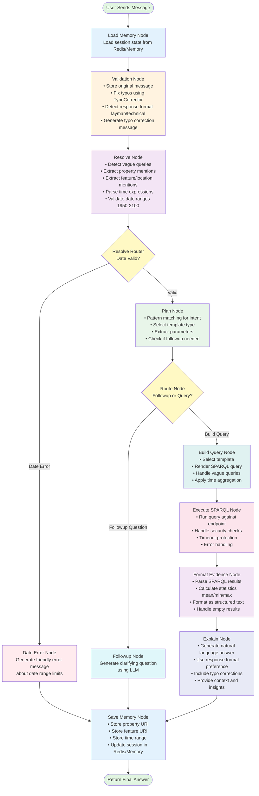

# Climate Chat Agent - Complete Workflow Flowchart

## Overview
This flowchart shows the complete workflow of the LangGraph-based climate chat agent from user input to final response.

## Flowchart Diagram



## Node Details

### 1. **Load Memory Node**
- **Purpose**: Initialize conversation context
- **Actions**:
  - Load from Redis if available
  - Fallback to in-memory store
  - Restore: property URI, feature URI, time range
- **Output**: State with loaded memory

### 2. **Validation Node**
- **Purpose**: Clean and prepare user input
- **Actions**:
  - Store original message for comparison
  - Correct typos using predefined dictionary
  - Detect response format (layman vs technical)
  - Generate correction messages if needed
- **Key Features**:
  - Early exit if no typos found (performance)
  - Fast keyword-based format detection
- **Output**: Corrected message + format preference

### 3. **Resolve Node**
- **Purpose**: Extract entities and temporal information
- **Actions**:
  - Detect vague climate queries
  - Match property keywords (temperature, precipitation, etc.)
  - Match feature/location keywords
  - Parse dates and time ranges using TimeParser
  - Validate dates are within 1950-2100 range
- **Fallbacks**:
  - Use session memory for missing entities
  - Allow vague queries with general_overview template
- **Output**: Resolved entities OR date validation error

### 4. **Resolve Router**
- **Purpose**: Conditional routing based on date validation
- **Routes**:
  - `date_error` → If date out of range
  - `planner` → If validation passed
- **Decision Logic**: Checks if `date_validation_error` is set

### 5. **Date Error Node**
- **Purpose**: Handle date range violations gracefully
- **Actions**:
  - Format friendly error message
  - Explain valid date range (1950-2100)
  - Skip query execution
- **Output**: Error message as final answer

### 6. **Plan Node**
- **Purpose**: Determine intent and select template
- **Pattern Matching**:
  - List properties/features
  - Specific property queries
  - Comparison queries
  - Statistical queries
  - Trend analysis
  - Vague overview queries
- **Actions**:
  - Select appropriate template
  - Extract parameters
  - Determine if followup needed
- **Templates**: 15+ SPARQL templates available
- **Output**: Plan with template + parameters

### 7. **Route Node**
- **Purpose**: Decide execution path
- **Routes**:
  - `followup` → If more info needed from user
  - `build_query` → If ready to execute
- **Decision Logic**: Checks plan's followup field

### 8. **Followup Node**
- **Purpose**: Ask clarifying questions
- **Actions**:
  - Generate natural language followup
  - Use LLM to craft helpful questions
  - Preserve context for next turn
- **Examples**:
  - "Which climate variable are you interested in?"
  - "Which location would you like data for?"
- **Output**: Followup question as final answer

### 9. **Build Query Node**
- **Purpose**: Generate SPARQL query
- **Actions**:
  - Render template with parameters
  - Handle time aggregation (daily → monthly)
  - Apply time range filters
  - Optimize query structure
- **Special Cases**:
  - Vague queries → Multi-property aggregation
  - Missing parameters → Use session defaults
- **Output**: Complete SPARQL query string

### 10. **Execute SPARQL Node**
- **Purpose**: Run query against knowledge graph
- **Actions**:
  - Execute SPARQL via SPARQLClient
  - Apply security checks
  - Handle timeouts (30s limit)
  - Parse results into structured format
- **Error Handling**:
  - Empty results → Provide suggestions
  - Timeout → Notify user to simplify query
  - Security error → Block malicious queries
- **Output**: List of result rows (dictionaries)

### 11. **Format Evidence Node**
- **Purpose**: Structure raw data for LLM
- **Actions**:
  - Calculate statistics (mean, min, max, std dev, variance)
  - Format as readable text
  - Group by time periods
  - Handle large result sets (summarize if >50 rows)
- **Output**: Evidence text string

### 12. **Explain Node**
- **Purpose**: Generate natural language answer
- **Actions**:
  - Use LLM to explain results
  - Apply response format (layman/technical)
  - Include typo corrections if any
  - Add context and insights
  - Cite specific values and trends
- **Format Options**:
  - **Layman**: Simple language, analogies
  - **Technical**: Scientific terms, precise values
- **Output**: Final natural language answer

### 13. **Save Memory Node**
- **Purpose**: Persist conversation context
- **Actions**:
  - Save property URI to session
  - Save feature URI to session
  - Save time range to session
  - Store in Redis or in-memory
  - 24hr TTL on Redis keys
- **Output**: State with saved memory flag

## Data Flow Summary

```
User Message
    ↓
[Load Previous Context]
    ↓
[Clean & Validate Input]
    ↓
[Extract Entities + Time]
    ↓
[Route: Valid or Error?]
    ↓
[Plan Intent + Template]
    ↓
[Route: Query or Followup?]
    ↓
[Build SPARQL Query]
    ↓
[Execute on Knowledge Graph]
    ↓
[Calculate Statistics]
    ↓
[Generate Natural Answer]
    ↓
[Save Context for Next Turn]
    ↓
Final Answer to User
```

## Key Features

### 🧠 **Memory System**
- Redis-backed session storage
- Fallback to in-memory store
- Remembers: property, feature, time range
- 24-hour session expiry

### ✅ **Validation Layer**
- Typo correction (100+ common mistakes)
- Date range validation (1950-2100)
- Response format detection
- Security checks

### 🎯 **Intent Detection**
- 15+ query patterns
- Template-based approach
- Handles vague queries
- Contextual followups

### 📊 **Data Processing**
- Statistical calculations
- Time aggregation (daily→monthly)
- Large result summarization
- Empty result handling

### 💬 **Response Generation**
- Dual format (layman/technical)
- LLM-powered explanations
- Contextual insights
- Error messaging

## Performance Optimizations

1. **Early Exit**: Validation node skips processing if no typos
2. **Caching**: Property keyword cache in resolve node
3. **Result Limiting**: Return max 10 rows to frontend
4. **Timeout Protection**: 30s limit on SPARQL queries
5. **Lazy Loading**: Memory only loaded once per session

## Error Handling

- **Date Errors**: Friendly message, skip query
- **Empty Results**: Query suggestions
- **SPARQL Timeout**: Simplification advice
- **Security Violations**: Block and log
- **LLM Failures**: Graceful fallbacks
- **Redis Failures**: Automatic in-memory fallback

## State Management

The `AgentState` TypedDict flows through all nodes and contains:

```python
{
    # Input
    "session_id": str,
    "user_message": str,
    "original_message": str,
    "history": List[Dict],
    "model": Optional[str],
    
    # Validation
    "typo_corrections": Dict,
    "typo_message": str,
    "date_validation_error": str,
    "response_format": str,
    
    # Memory
    "selected_property_uri": str,
    "selected_feature_uri": str,
    "time_range": Dict,
    
    # Processing
    "plan": Dict,
    "sparql_query": str,
    "sparql_rows": List,
    "evidence_text": str,
    "final_answer": str,
    
    # Debug
    "debug": Dict
}
```

## Example Flow: "Show me temperature in London for 2020"

1. **Load Memory**: No previous context
2. **Validation**: No typos, format = auto
3. **Resolve**: 
   - Property: temperature (tas)
   - Feature: London
   - Time: 2020-01-01 to 2020-12-31
4. **Router**: Valid date → Planner
5. **Planner**: Template = specific_property_time_series
6. **Router**: Has all params → Build Query
7. **Build Query**: Render SPARQL with parameters
8. **Execute**: Query returns 365 daily values
9. **Format**: Calculate mean=15.2°C, min=5.1°C, max=28.3°C
10. **Explain**: "In 2020, London experienced an average temperature of 15.2°C..."
11. **Save**: Store property=tas, feature=London, time=2020
12. **Return**: Final answer with stats

## Follow-up Example: "What about 2021?"

1. **Load Memory**: Restore property=tas, feature=London
2. **Validation**: No typos
3. **Resolve**: 
   - Property: tas (from memory)
   - Feature: London (from memory)
   - Time: 2021-01-01 to 2021-12-31 (new)
4. **Continue flow**: Uses memory context for seamless experience

---

**Generated**: February 4, 2026  
**Agent Version**: LangGraph-based Template KG-RAG  
**Framework**: LangGraph + FastAPI
