# Climate Chat Agent - Workflow Flowcharts

This document provides comprehensive flowcharts and explanations for the Climate Chat Agent's workflows.

---

## Table of Contents
1. [Complete System Architecture](#complete-system-architecture)
2. [Frontend Workflow](#frontend-workflow)
3. [LangGraph Agent Workflow](#langgraph-agent-workflow)
4. [Node Descriptions](#node-descriptions)
5. [Example Query Flows](#example-query-flows)

---

## Complete System Architecture

```mermaid
graph TB
    subgraph "User Interface"
        UI[Web Browser]
        HTML[index.html]
        JS[script.js]
        CSS[style.css]
    
    subgraph "Backend API Layer"
        API[FastAPI Server<br/>main.py]
        Cache[Query Cache]
        RateLimit[Rate Limiter]
    
    subgraph "LangGraph Agent"
        Agent[Graph Agent<br/>graph_agent.py]
    
    subgraph "Processing Modules"
        LLM[LLM Client<br/>llama3.2/gpt-4]
        Parser[Parsers<br/>time/typo/property]
        Formatter[Response Formatter<br/>layman/technical]
    
    subgraph "Data Layer"
        SPARQL[SPARQL Endpoint<br/>GraphDB]
        Memory[Session Memory<br/>Redis/In-Memory]
    
    UI --> HTML
    HTML --> JS
    JS -->|POST /chat| API
    API --> RateLimit
    RateLimit --> Cache
    Cache -->|Cache Miss| Agent
    Agent --> LLM
    Agent --> Parser
    Agent --> Formatter
    Agent --> SPARQL
    Agent --> Memory
    SPARQL -->|Climate Data<br/>1950-1951| Agent
    Agent -->|Response| API
    API -->|JSON| JS
    JS -->|Display| UI
```

**Explanation:**
- **User Interface**: Simple web interface with chat-like experience
- **API Layer**: FastAPI handles requests, implements caching and rate limiting
- **LangGraph Agent**: Core processing pipeline with multiple nodes
- **Processing Modules**: NLP, parsing, formatting capabilities
- **Data Layer**: GraphDB SPARQL endpoint + session memory

---

## Frontend Workflow

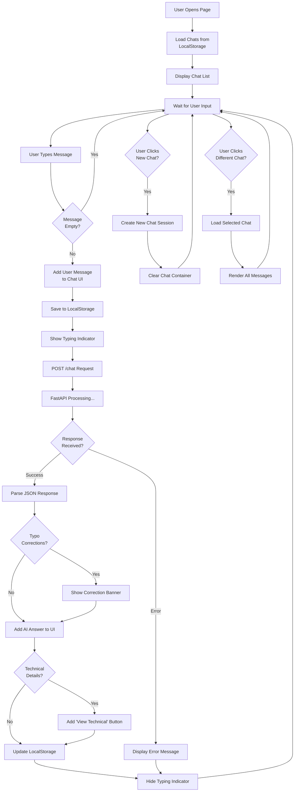

**Explanation:**

### Key Components:
1. **LocalStorage Management**: All chats persist in browser
2. **Session Handling**: Each chat has unique UUID session ID
3. **UI Updates**: Real-time message display with typing indicators
4. **Error Handling**: Graceful error display with retry options

### Features:
- **Chat Persistence**: Conversations saved locally
- **Multiple Chats**: Create/switch/delete chat sessions
- **Auto-title**: First message becomes chat title
- **Technical Toggle**: Expandable technical details

---

## LangGraph Agent Workflow

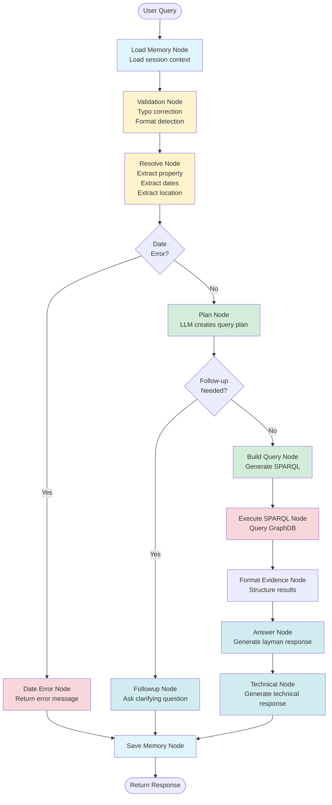

**Explanation:**

### Pipeline Flow:
1. **Load Memory** (Blue): Retrieve session context from Redis/memory
2. **Validation** (Yellow): Clean and validate input
3. **Resolution** (Yellow): Extract entities (property, date, location)
4. **Planning** (Green): LLM decides which query template to use
5. **Query Building** (Green): Generate SPARQL query
6. **Execution** (Red): Query the knowledge graph
7. **Formatting** (Cyan): Structure evidence and generate responses
8. **Save Memory** (Blue): Persist session state

### Conditional Routing:
- **Date Error Route**: Invalid dates skip to error response
- **Followup Route**: Missing info triggers clarification question
- **Main Route**: Complete info flows through full pipeline

---

## Node Descriptions

### 1. Load Memory Node
**Purpose**: Load session context for conversation continuity

**What it does:**
- Retrieves property URI, feature URI, time range, location from previous messages
- Uses Redis (if available) or in-memory fallback
- Enables multi-turn conversations

**Example:**
```
User: "Show temperature for 1950-06-15"
[Memory stores: property=temperature, date=1950-06-15]

User: "What about humidity?"
[Memory retrieves: date=1950-06-15 (reuses)]
```

---

### 2. Validation Node
**Purpose**: Clean and validate user input

**What it does:**
- **Typo Correction**: Fixes common misspellings
  - "temprature" → "temperature"
  - "humidty" → "humidity"
  - "percipitation" → "precipitation"
- **Format Detection**: Determines if user wants layman or technical response
  - Keywords: "simple", "explain", "technical", "debug"
- **Security**: Prevents injection attacks

**Example:**
```
Input: "Show me temprature data simply"
↓
Corrected: "Show me temperature data simply"
Typo corrections: {temprature: temperature}
Response format: layman
```

---

### 3. Resolve Node
**Purpose**: Extract structured information from natural language

**What it extracts:**
1. **Property/Variable**:
   - temperature, humidity, precipitation, wind, etc.
   - Maps to SOSA ontology URIs
   
2. **Time Information**:
   - Specific dates: "1950-06-15", "June 15, 1950"
   - Date ranges: "June 1950", "1950 to 1951"
   - Year/month: "1950", "June 1951"
   - Validates against available range (1950-1951)
   
3. **Location**:
   - Country names: "Germany", "France", "UK"
   - Coordinates: "lat: 52.5, lon: 13.4"
   - Validates against available regions (Europe/Mediterranean)

**Example:**
```
"Show temperature for Germany in June 1950"
↓
Property URI: http://hyobs.../Temperature
Location: Germany
Time range: 1950-06-01 to 1950-07-01
```

---

### 4. Date Validation & Error Handling

**Date Validation Flow:**
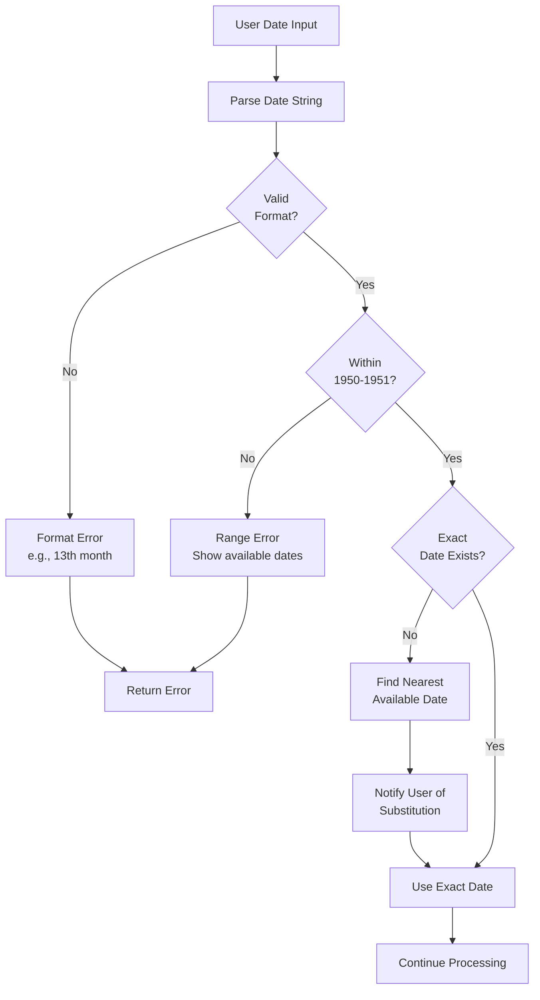

**Error Messages:**
```
❌ "2023-05-15" → "Sorry, data is only available for 1950-1951. Try '1950-05-15' instead."
❌ "1951-13-01" → "Invalid date: month must be between 1-12"
✅ "1950-02-29" → "Using nearest available date: 1950-02-28 (1950 was not a leap year)"
```

---

### 5. Plan Node
**Purpose**: Use LLM to select appropriate query template

**Available Templates:**
1. **list_properties**: List all climate variables
2. **list_features**: List all observation stations
3. **all_properties_summary**: Overview of ALL variables (for vague queries)
4. **average_for_property_date_range**: Calculate average
5. **top_extremes_for_property**: Find highest/lowest values
6. **timeseries_statistics**: Mean, min, max, std dev, variance
7. **daily_aggregates**: Daily statistics
8. **monthly_aggregates**: Monthly statistics
9. **filtered_timeseries**: Filter by value range

**LLM Decision Process:**
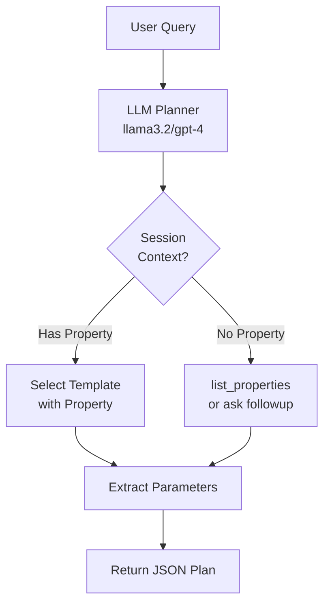

**Fast Paths (Skip LLM):**
- "list variables" → list_properties
- "list stations" → list_features
- "explain climate" + date → all_properties_summary

---

### 6. Build Query Node
**Purpose**: Generate SPARQL query from template

**Process:**
1. Load query template from [query_templates.py](src/query/query_templates.py)
2. Inject parameters (property URI, dates, limits)
3. Add security constraints (FROM graph, SELECT only)
4. Validate query safety

**Example:**
```sparql
SELECT ?value ?timestamp ?unit
FROM <http://hyobs.nfdi4earth.de/graph/climateobservations>
WHERE {
  ?obs sosa:observedProperty <http://hyobs.../Temperature> .
  ?obs sosa:hasSimpleResult ?value .
  ?obs sosa:resultTime ?timestamp .
  FILTER(?timestamp >= "1950-06-01T00:00:00"^^xsd:dateTime)
  FILTER(?timestamp < "1950-07-01T00:00:00"^^xsd:dateTime)
}
LIMIT 200
```

---

### 7. Execute SPARQL Node
**Purpose**: Query the knowledge graph

**What it does:**
- Sends SPARQL query to GraphDB endpoint
- Timeout protection (30 seconds max)
- Error handling for network/syntax issues
- Security validation (blocks INSERT/DELETE/DROP)

**Data Source:**
- GraphDB SPARQL endpoint
- Climate observations 1950-1951
- SOSA/SSN ontology structure

---

### 8. Format Evidence Node
**Purpose**: Structure raw SPARQL results into readable evidence

**What it creates:**
- Query metadata (template used, row count)
- Property/time range information
- Formatted result preview
- Statistical summaries (for aggregation queries)

**Example:**
```
Query type: timeseries_statistics
Result count: 1
Property: Temperature
Time range: 1950-06-01 to 1950-07-01
Statistical Summary:
  Mean: 18.5 °C
  Min: 12.3 °C
  Max: 26.8 °C
  Count: 894 observations
  Estimated Std Dev: 2.41 °C
  Range: 14.5 °C
```

---

### 9. Answer Node
**Purpose**: Generate layman-friendly response

**What it does:**
- Uses LLM to convert technical data into natural language
- Adapts to response format (simple/technical)
- Adds context and explanations
- Handles typo corrections gracefully

**Example Output:**
```
In June 1950, the average temperature was about 18.5°C. 
The temperatures ranged from a cool 12.3°C to a warm 26.8°C. 
We have 894 observations from various locations during this month, 
showing typical early summer conditions.
```

---

### 10. Technical Node
**Purpose**: Generate detailed technical response

**What it includes:**
- SPARQL query used
- Raw result count
- Statistical details (std dev, variance)
- Template information
- Execution times
- Debug metadata

**Example Output:**
```
TECHNICAL DETAILS:
Template: timeseries_statistics
Property URI: http://hyobs.nfdi4earth.de/resource/property/Temperature
Time Range: 1950-06-01T00:00:00 to 1950-07-01T00:00:00
Results: 894 observations

Statistics:
- Mean: 18.5°C
- Standard Deviation: 2.41°C
- Variance: 5.81°C²
- Min: 12.3°C
- Max: 26.8°C
- Range: 14.5°C

SPARQL Query:
[Shows full query]

Execution Time: 0.234s
```

---

### 11. Save Memory Node
**Purpose**: Persist session context for next interaction

**What it saves:**
- selected_property_uri
- selected_feature_uri
- location_name
- coordinates (lat/lon)

**Storage:**
- Redis (if configured)
- In-memory fallback
- Session TTL: 30 minutes

---

## Example Query Flows

### Example 1: Simple Date Query

**Query:** "Show temperature for 1950-06-15"

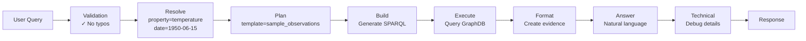

**Response Flow:**
1. ✓ No typos detected
2. ✓ Property: Temperature
3. ✓ Date: 1950-06-15 (valid)
4. → Query returns 24 observations
5. → Answer: "On June 15, 1950, we recorded 24 temperature observations..."

---

### Example 2: Out-of-Range Date

**Query:** "Show temperature for 2023-05-15"

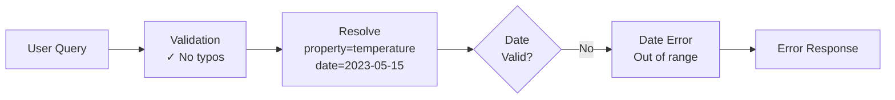

**Response:**
```
❌ Sorry, the date 2023-05-15 is outside the available range.

This dataset contains climate observations from 1950-01-01 to 1951-12-31 only.

Suggestion: Try "Show temperature for 1950-05-15" instead.
```

---

### Example 3: Typo Correction

**Query:** "Show temprature for 1950-06-15"


**Response includes:**
```
ℹ️ I corrected: temprature → temperature

On June 15, 1950, we recorded 24 temperature observations...
```

---

### Example 4: Vague Query with All Variables

**Query:** "Explain climate data simply"

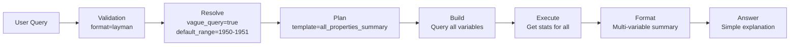

**Response:**
```
Here's a simple overview of the climate data from 1950-1951:

🌡️ Temperature: Average 15.2°C, ranging from -8.5°C to 38.1°C
💧 Humidity: Average 72.3%, ranging from 25% to 98%
☔ Precipitation: Average 2.4mm per day, ranging from 0mm to 45mm
💨 Wind Speed: Average 3.2 m/s, ranging from 0 m/s to 18.5 m/s

This data covers 2 years of observations across European stations.
```

---

### Example 5: Statistical Aggregation

**Query:** "What is the average temperature in 1950?"

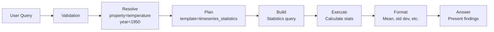

**Response:**
```
In 1950, the average temperature across all observation stations was 15.2°C.

Statistics:
- Standard Deviation: 8.3°C (showing seasonal variation)
- Minimum: -8.5°C (winter months)
- Maximum: 38.1°C (summer months)
- Total observations: 127,456

This data reflects the full year's seasonal changes across European locations.
```

---

### Example 6: Multi-turn Conversation

**Turn 1:** "Show temperature for 1950-06-15"
- Memory saves: property=temperature, date=1950-06-15

**Turn 2:** "What about humidity?"
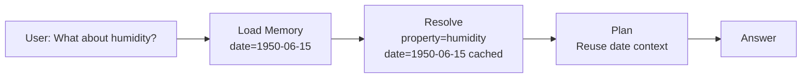

**Response:**
```
For the same date (June 15, 1950), the humidity observations showed...
```

---

## Performance Optimizations

### 1. Fast Paths
- Common queries skip LLM planning
- Keyword detection for templates
- Early returns on errors

### 2. Caching
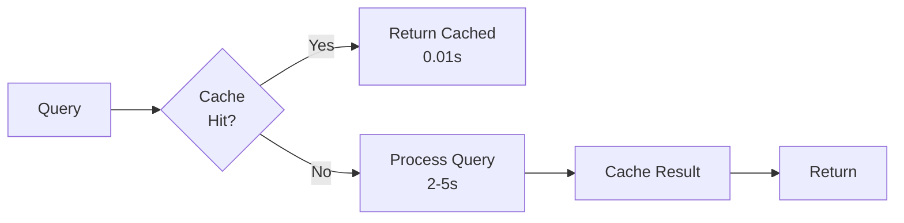

### 3. Rate Limiting
- 30 requests per minute per session
- Prevents API abuse
- Protects backend resources

---

## Error Handling

### Error Types & Responses:

1. **Invalid Date Format**
   ```
   ❌ "Invalid date: month must be between 1-12"
   ```

2. **Out of Range Date**
   ```
   ❌ "Date outside available range (1950-1951)"
   💡 "Try: Show temperature for 1950-05-15"
   ```

3. **No Data Found**
   ```
   ℹ️ "No observations found for these criteria"
   💡 "Try a different date or property"
   ```

4. **Query Timeout**
   ```
   ⏱️ "Query timed out. Try narrowing your date range."
   ```

5. **Security Violation**
   ```
   🔒 "Security violation: Forbidden operation"
   ```

---

## Session Memory Behavior

### What Gets Remembered:
✓ Property selection (temperature, humidity, etc.)
✓ Location context (country, coordinates)
✓ Feature URI (if specified)

### What Gets Forgotten:
✗ Specific query templates (selected fresh each time)
✗ SPARQL queries (rebuilt each time)
✗ Conversation history (for context, not memory)

### Memory Lifetime:
- **Active session**: Indefinite (until page refresh)
- **Redis TTL**: 30 minutes of inactivity
- **LocalStorage**: Persistent (chat history only)

---

## Query Template Selection Logic

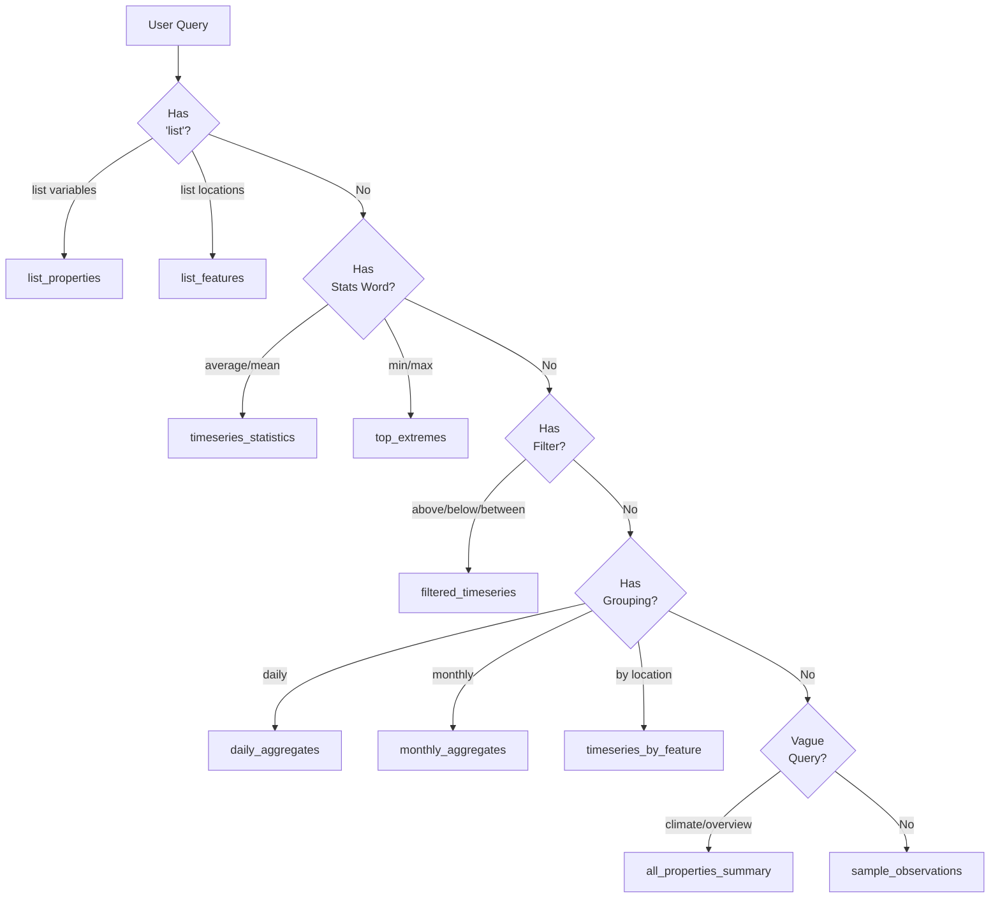

---

## Security Measures

### SPARQL Query Protection:
1. **Whitelist**: Only SELECT queries allowed
2. **Blacklist**: INSERT, DELETE, DROP, LOAD blocked
3. **Graph Constraint**: Must query specific graph IRI
4. **Limit Enforcement**: Max 500 results per query
5. **Timeout**: 30 second execution limit

### API Protection:
1. **Rate Limiting**: 30 requests/minute per session
2. **CORS**: Configurable origins
3. **Input Validation**: Sanitize all user inputs
4. **Error Masking**: Don't expose system details

---

## Troubleshooting Guide

### Common Issues:

**1. "No data found"**
- Check date is within 1950-1951
- Verify property spelling
- Try broader date range

**2. "Query timeout"**
- Narrow date range (try single month)
- Use aggregation instead of raw data
- Check SPARQL endpoint status

**3. "Typo corrections not working"**
- Check typo_corrector.py dictionary
- Add new corrections if needed
- Verify validation_node is running

**4. "Session memory not persisting"**
- Check Redis connection
- Verify session_id consistency
- Check memory_store logs

---

## Development Notes

### Adding New Templates:
1. Add template to [query_templates.py](src/query/query_templates.py)
2. Update LLM system prompt in plan_node
3. Add formatting logic in format_evidence_node
4. Test with various queries

### Modifying Node Logic:
1. Edit node function in [graph_agent.py](src/agent/graph_agent.py)
2. Update routing conditions if needed
3. Test full pipeline
4. Update this documentation

### Performance Tuning:
1. Add fast paths in plan_node
2. Expand cache coverage
3. Optimize SPARQL queries (use LIMIT, FILTER early)
4. Profile with debug timings

---

## Metrics & Monitoring

### Key Performance Indicators:

```
Load Memory:     < 0.01s
Validation:      < 0.05s
Resolution:      < 0.1s
Planning:        0.5-2s (LLM call)
Query Build:     < 0.01s
SPARQL Execute:  0.2-5s (depends on query)
Format Evidence: < 0.1s
Answer Gen:      0.5-2s (LLM call)
Technical Gen:   0.5-2s (LLM call)
Save Memory:     < 0.01s

Total Pipeline:  2-10s typical
```

### Debug Output:
Check `state["debug"]` for:
- Node execution times
- Memory operations
- LLM provider/model used
- Cache hits/misses
- Error traces

---

## Conclusion

This climate chat agent implements a sophisticated Template-based KG-RAG (Knowledge Graph Retrieval Augmented Generation) workflow using LangGraph. The system combines:

- **Natural Language Understanding** (LLM planning)
- **Knowledge Graph Querying** (SPARQL)
- **Session Memory** (Redis/in-memory)
- **Dual Response Formats** (layman + technical)
- **Robust Error Handling** (validation, security)
- **Performance Optimization** (caching, fast paths)

The modular node-based architecture makes it easy to extend, debug, and maintain.

---

**Last Updated:** 2025
**Version:** 2.0.0
**Maintained by:** Climate Agent Team
